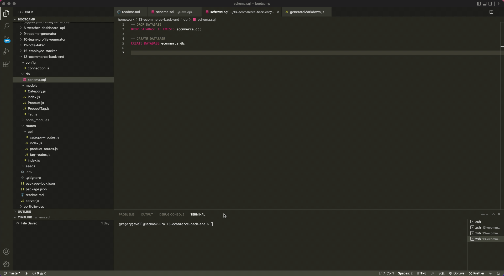

# eCommerce Back-end

## Description

This application provides a backend to an eCommerce website using Express.js and Sequelize complete with models, and routes.

## Table of Contents

- [Installation](#installation)
- [Usage](#usage)
- [Contact](#contact)

## Installation

To install this application you can clone the repository and install dependencies using `npm install`. You'll then need to install the DB by either running the schema within MySQL Workbench
or typing `mysql -u root -p` into the terminal, followed by `source ./db/schema.sql`. Exit out of mySQL prompt. Next, you'll run `npm run seed`. I've created a short video on how to initialize the database that you can find here:

## Usage

First, type in `npm run start` to start the application. You'll use the endpoints beginning with localhost:3001/api, and will be able to test endpoints with Insomnia.

A video demonstrating the different routes available can be found here:

## Contact

You can contact me via email at [gdjewell@gmail.com](mailto:gdjewell@gmail.com) or on GitHub [@gdjewell](https://github.com/gdjewell).
